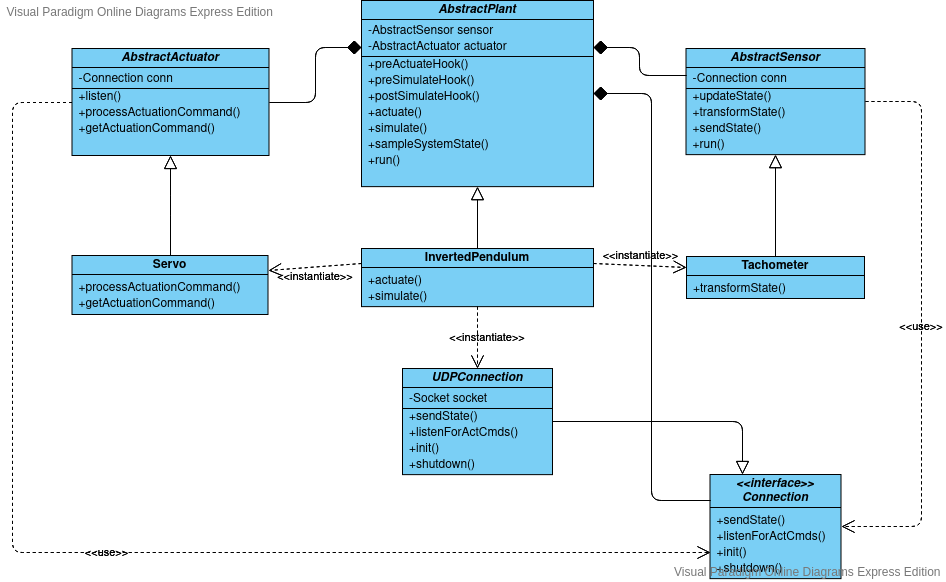
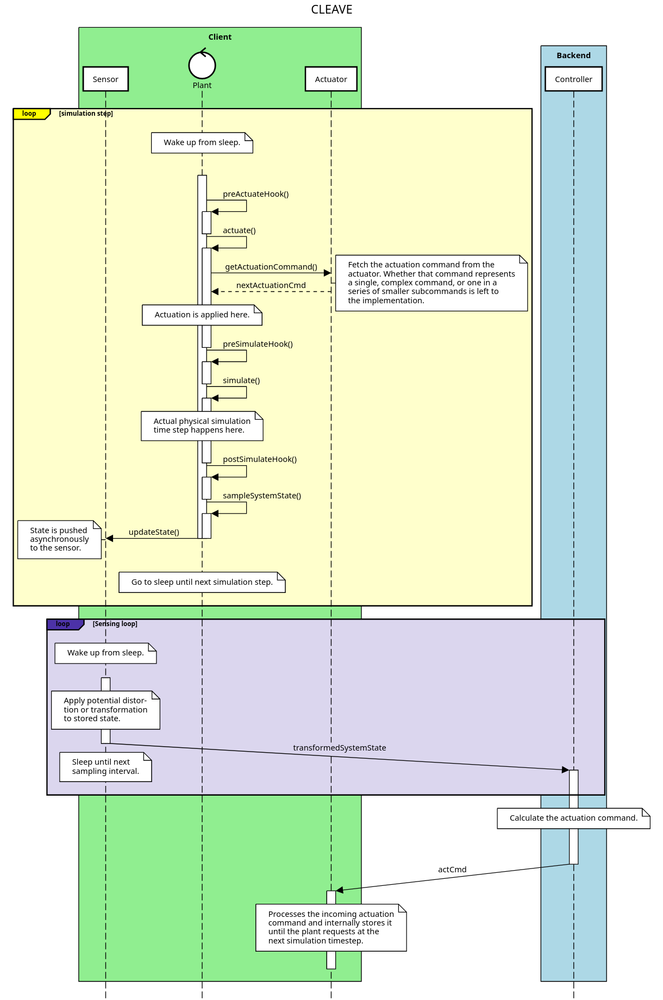

# CLEAVE Project

CLEAVE - ControL bEnmArking serVice on the Edge: A framework for testing, benchmarking and evaluating control loop applications on the Edge, written in Python 3.8+.
---
*Note: This project is in early stages of development.*
---

## Architectural design:

Class Diagram: 


UML Sequence Diagram: 


## General Structure of the Project

- This repository contains the top-level structure of the project, as well as associated documentation.
- The `cleave/client` subrepository contains the code associated to the `cleave.client` subpackage. This package includes all the functionality needed for the client software: emulation of plants, benchmarking and network code to connect to the backend.
- The `cleave/backend` subrepository contains the code associated to the `cleave.backend` subpackage. This package includes the functionality needed for the backend: server software, control algorithms modularized into microservices and some benchmarking functionality.


## Setup:

To clone the whole project at once:

```bash
git clone --recurse-submodules -j8 git@github.com:KTH-EXPECA/CLEAVE.git
```

or 

```bash
git clone git@github.com:KTH-EXPECA/CLEAVE.git
cd CLEAVE
git submodule update --init --recursive
```

For instructions on how to clone individual submodules, head to the respective Git repository pages.

## License

Copyright 2020 KTH Royal Institute of Technology

Licensed under the Apache License, Version 2.0 (the "License"); you may not use this project except in compliance with the License. A copy of the license is included in the [LICENSE](LICENSE) file.

Unless required by applicable law or agreed to in writing, software distributed under the License is distributed on an "AS IS" BASIS, WITHOUT WARRANTIES OR CONDITIONS OF ANY KIND, either express or implied. See the License for the specific language governing permissions and limitations under the License.
