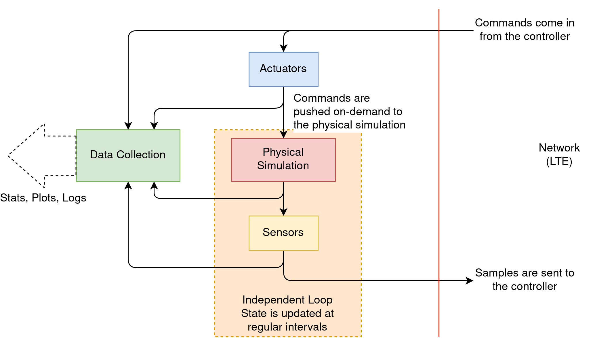
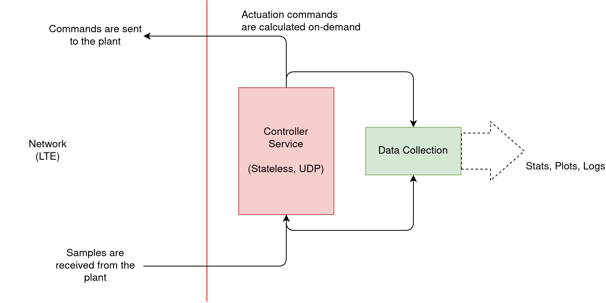

# Configuring a Networked Control System emulation with CLEAVE

CLEAVE emulations have two main components:

- A `Plant` which corresponds to the representation of the physical system being controlled.
- A `Controller`, which implements the necessary logic to control the `Plant`. 

In turn, these components are themselves composed of smaller sub-components:

- Plants are composed of 
    - A `State`, which implements the discrete-time physical evolution of the system being emulated.
    - A collection of `Sensors`, which implement the processing and sampling of physical measures of the system.
    - A collection of `Actuators`, which receive inputs from the `Controller` and apply them to the system.
    

    
- Controllers are simpler, and have a single sub-component: a `ControllerService`, which simply implements a method to obtain an actuation from a set of samples from the plant.



In the following, we will give an introduction to the configuration of `Plants` and `Controllers` in CLEAVE. A key point here is that the configuration of any of these components is done in Python, and thus allows for the easy extension of CLEAVE with new physical simulations, sensors, actuators and controllers.

## Configuring the Plant

Any plant config script in CLEAVE needs to define the following top-level variables:

- `state`, assigned to an object of a class which extends `cleave.base.client.state.State`.
- `sensors`, a sequence of objects of classes extending `cleave.base.client.sensor.Sensor`.
- `actuators`, a sequence of objects of classes extending `cleave.base.client.actuator.Actuator`.

The framework currently provides some implementations of these classes, please see the respective source files for details.

An example plant config would then look something like this:

```python
from cleave.core.client import SimpleActuator
from cleave.api.plant import Sensor, SimpleSensor, State

class InvPendulumState(State):
    ...

class NoisySensor(Sensor):
    ...


state = InvPendulumState(upd_freq_hz=200)
sensors = [
    NoisySensor('position', 100),
    SimpleSensor('speed', 100),
    NoisySensor('angle', 100),
    SimpleSensor('ang_vel', 100),
]
actuators = [
    SimpleActuator('force')
]
```

## Configuring the Controller

The controller config file on the other hand needs to define a single top-level variable `controller`. This variable needs to point to an object of a class extending `cleave.base.backend.controller.Controller`.
See this source file for details on what a controller needs to implement.

```python

from cleave.api.controller import Controller

class InvPendController(Controller):
    ...

controller = InvPendController()

```
